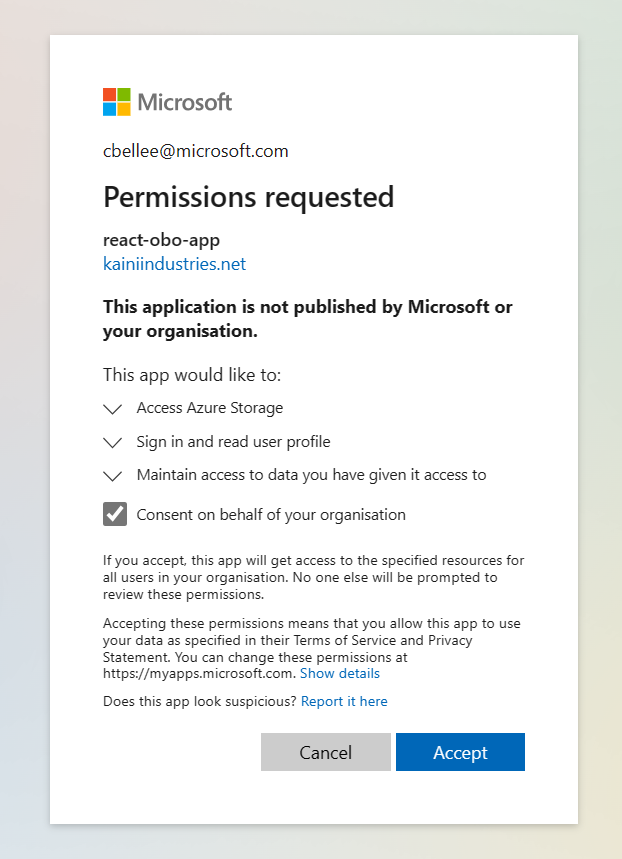
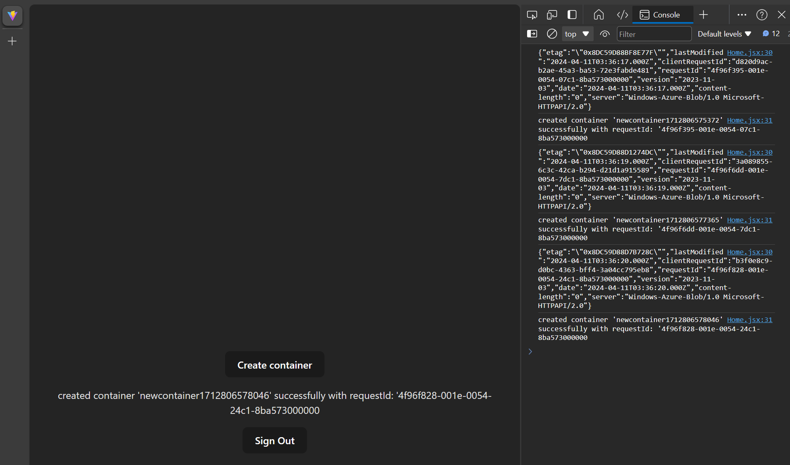

# React MSAL on Behalf of authentication for Microsoft Entra ID

## Pre-requisites

- Azure CLI
- Azure Subscription
- npm

## Setup

- Login to the Azure CLI & set your subscription context
  - `$ az login` 
  - `$az account set -s <subscriptionId>`
- Run the script
  - `$ ./setup.sh`
- Browse to `http://localhost:5173` to view the app
- You will be prompted for Admin Consent for the app. You'll need to have EntraID tenant admin rights to do this.

